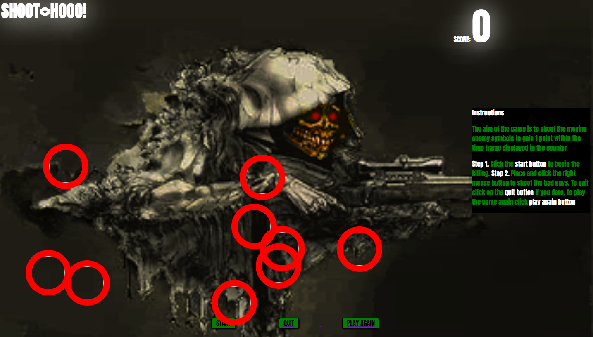

# Game Project

## Attack-hooo!

#### Description:
A fun single-player game which will displays animated Marvel logos and their logos. The aim of the game is to shoot the enemy logos and gain points before the timer finishes. 

###Game Image

###Instructions 

• Step 1. Click on [Game Link ](https://saltsplinkler12.github.io/Game-Project/)

• Step 2. Click on Start

• Step 3. Shoot Marvel enemy images by right-clicking on them 
 
##Game Conditions 

• Do not shoot the Marvel Images as you will loose a point 

• Shoot Five Marvel Enemies to win game

• Shoot five within 20 seconds.